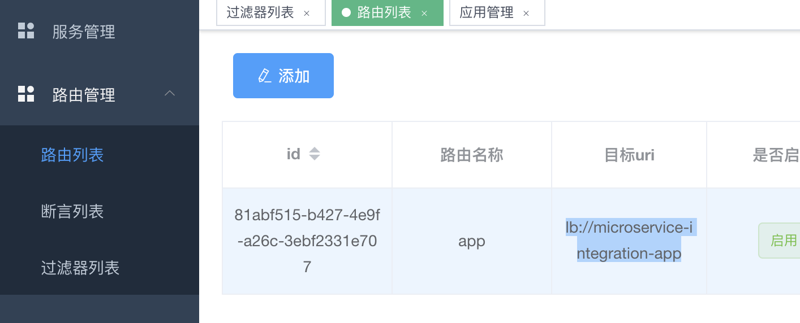
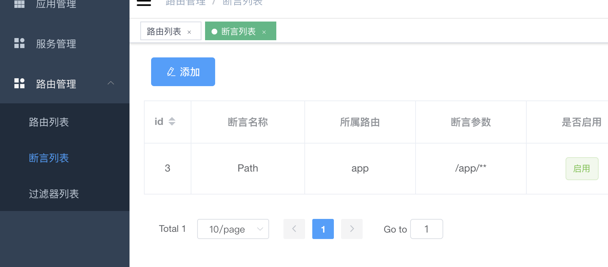
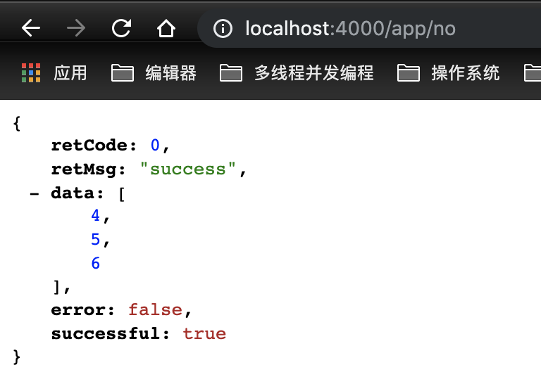

# Getting Started
### 网关后台管理系统

创建gateway数据库，执行doc/gateway.sql 。

执行doc/nacos.sql 插入nacos配置数据
(如不想使用nacos配置中心
则使用/microservice-integration-gateway/resource中 
```
bootstrap-eureka.yaml
```
使用eureka 需要启动eureka服务端  
使用nacos需要启动nacos。   

nacos控制台访问地址
```
http://localhost:8848/nacos
```

##### 启动 microservice-integration-eureka 

eureka控制台访问地址：

```
localhost:3000
```

#### 启动 microservice-integration-gateway

网关接口地址:

```
localhost:4000
```

#### 启动 microservice-integration-auth
auth接口地址:
```
localhost:4001
```

#### 启动 microservice-integration-app
app接口地址:
```bash
localhost:4002
```

通过网关访问：

```
localhost:4000/app/no
```

二、网关后台 microservice-integration-admin

```
进入microservice-integration-admin目录
1.安装node yarn npm
2.执行 yarn 安装依赖
3.执行 npm run dev 启动测试环境
```

验证码使用 谷歌 recaptcha-v3  的vue插件

```
vue-recaptcha-v3 
https://developers.google.com/recaptcha/docs/v3
对应 /src/main.js中相应代码
```

访问地址：

```
localhost:9528
```

登录用户名密码随意填写


## 技术栈

#### springboot版本

```
2.2.4.RELEASE
```

#### spirngcloud版本

```
Hoxton.SR6
```

#### nacos

```
https://nacos.io/zh-cn/docs/what-is-nacos.html
```
#### spirngcloud-gateway

```
https://cloud.spring.io/spring-cloud-gateway/single/spring-cloud-gateway.html
```
#### 

#### open-fegin

```
https://cloud.spring.io/spring-cloud-openfeign/2.0.x/single/spring-cloud-openfeign.html
```

#### ribbon客户端负载均衡

```
https://cloud.spring.io/spring-cloud-static/spring-cloud-netflix/2.1.0.M1/single/spring-cloud-netflix.html
```

#### 网关后台 vue-admin-template

```
https://github.com/PanJiaChen/vue-admin-template/blob/master/README-zh.md
```

### 说明

#### microservice-integration-eureka

eureka注册中心

#### microservice-integration-app

测试应用app

#### Microservice-integration-auth

应用鉴权

#### microservice-integration-gateway

springcloud-gateway 网关 

#### Microservice-integration-gateway-admin

##  网关后台管理
### 1.服务管理功能
根据配置的应用信息，接口信息。动态启动，禁用接口。
    
- 1.1 手动填写应用信息
- 1.2 服务上报      
```
通过使用 服务上报插件 microservice-integration-gateway-report 
应用启动时自动上报 ${spring.application.name}为应用名的应用   
自动上报 @GatewayInfo 注解配置的接口
```
### 2.鉴权功能
- 2.1鉴权依赖鉴权服务器 microservice-integration-auth        
支持 不鉴权，用户登录，服务端鉴权 三种方式，可以自由扩展

### 3.动态路由
将springcloud gateway 路由配置持久化到数据库，可动态修改，实现动态路由。

- 3.1服务通过网关访问  
首先走GatewayServiceManagerAuthorizationFilter鉴权过滤器，先查询服务是否注册，未注册返回未授权应用。

- 3.2根据不同鉴权配置，访问auth应用 

- 3.3根据mysql中的路由配置路由到应用系统  

### 功能介绍

例如app应用，有多个接口。      
microservice-integration-app 服务 

```
spring.application.name=microservice-integration-app

有三个服务
@GetMapping("/info")
    @GatewayInfo(name="获取app信息",authorization = AuthorizationEnum.SERVER)
    public ResponseResult getAppInfo(){
        return ResponseResult.success("appInfo");
    }

    @PostMapping("/list")
    @GatewayInfo(name="获取app list",authorization = AuthorizationEnum.LOGIN)
    public ResponseResult getList(){
        return ResponseResult.success(Lists.newArrayList(1,2,3));
    }

    @GetMapping("/no")
    @GatewayInfo(name="不需要鉴权",authorization = AuthorizationEnum.NO)
    public ResponseResult no(){
        return ResponseResult.success(Lists.newArrayList(4,5,6));
    }

```

服务配置注解，依赖microservice-integration-gateway-report 
服务启动会上报服务到网关，没有声明鉴权注解默认不鉴权，直接可以访问

```
@GatewayInfo(name="不需要鉴权",authorization = AuthorizationEnum.NO)

鉴权方式枚举
public enum AuthorizationEnum {

    NO(0,"不鉴权"),
    LOGIN(1,"用户登录"),
    SERVER(2,"服务端鉴权");
}

```

2.在网关后台配置路由规则 
	2.1 配置路由管理

​	例如服务app应用名称为        

```
spring.application.name=microservice-integration-app
```
- 添加路由规则（spirngcloud gateway 的路由规则）    
​	如图：



如使用注册中心，则目标uri为lb://${应用名称}

​	2.2 配置断言列表



配置拦截路径 选择所属路由，如图 /app/**    则拦截 /app/** 所有请求  —>  所属路由的 目标uri

如上如配置完成后即可通过网关访问app 应用服务

如网关地址 http://127.0.0.1:4000/

app应用访问地址为 http://127.0.0.1:4000/app/**

如图：



2.自定义服务管理

### microservice-integration-gateway-report

服务上报 ，依赖microservice-integration-gateway-report后 

通过 @GatewayInfo(name="获取app信息",authorization = AuthorizationEnum.SERVER)

启动时向gateway 上报 应用服务信息。

